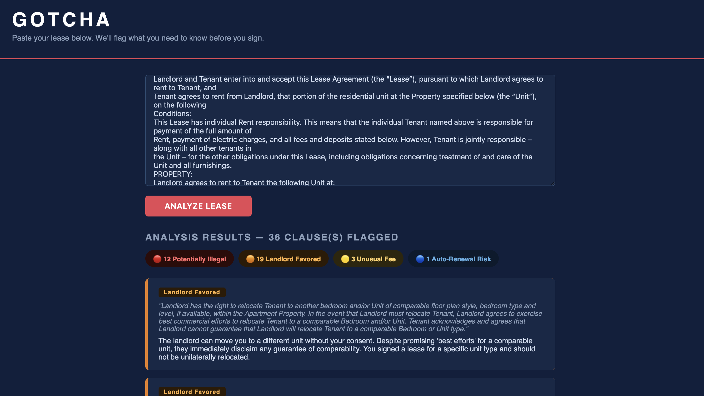

 # Gotcha 🔍

> Gotcha reads your lease so you don't have to.

Paste any rental agreement and instantly get a plain-English breakdown of suspicious, unfair, or potentially illegal clauses — color coded by risk level.


---

## What It Does

Most people sign leases without fully understanding what they're agreeing to. Legal language is dense and confusing on purpose. Gotcha analyzes your lease at the clause level and flags:

- 🔴 **Potentially Illegal** — clauses that may violate tenant rights laws
- 🟠 **Landlord Favored** — clauses that heavily favor the landlord
- 🟡 **Unusual Fee** — unexpected or excessive charges
- 🔵 **Auto-Renewal Risk** — clauses that could trap you in a lease extension

---

## Demo



---

## Tech Stack

- **Backend** — Python, Flask
- **AI** — Anthropic Claude API (claude-sonnet-4-6)
- **Frontend** — HTML, CSS
- **NLP Task** — Clause-level text classification

---

## Getting Started

### 1. Clone the repo
```bash
git clone https://github.com/ThaiTheGuy/Gotcha.git
cd Gotcha
```

### 2. Install dependencies
```bash
pip install flask anthropic python-dotenv
```

### 3. Add your API key
Create a `.env` file in the root folder:
Get your API key at [console.anthropic.com](https://console.anthropic.com)

### 4. Run the app
```bash
python app.py
```

Then open `http://127.0.0.1:5000` in your browser.

---

## Project Structure
gotcha/
├── app.py              # Flask app and Claude API integration
├── templates/
│   └── index.html      # Frontend UI
├── static/             # Screenshots and assets
├── .env                # API key (never committed)
├── .gitignore
└── README.md
---

## Future Plans

- PDF upload support
- Overall risk score at the top of each analysis
- State-specific tenant rights awareness
- Expand beyond leases — ToS agreements, employment contracts, app permissions
- Mobile friendly layout
- Save and share analysis reports

---

## Author

**Thai Strong**

[GitHub](https://github.com/ThaiTheGuy) · [LinkedIn](https://linkedin.com/in/your-linkedin-here)

---

> Built because nobody should sign something they don't understand.